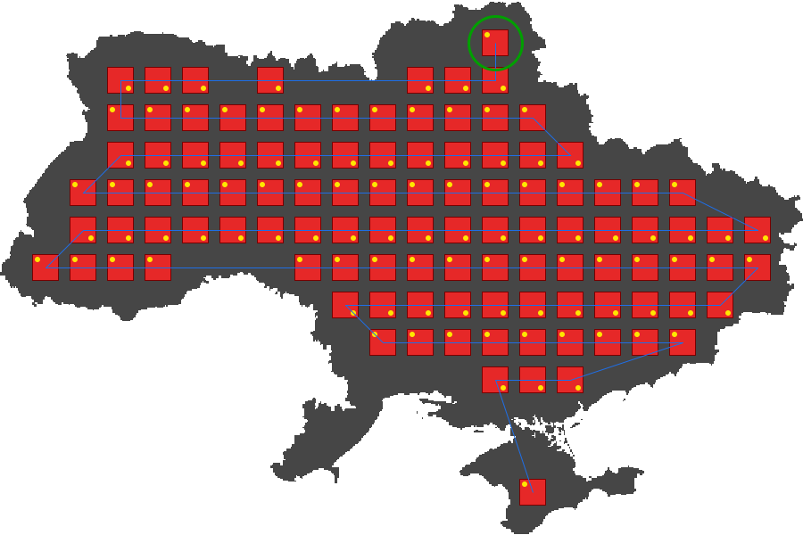
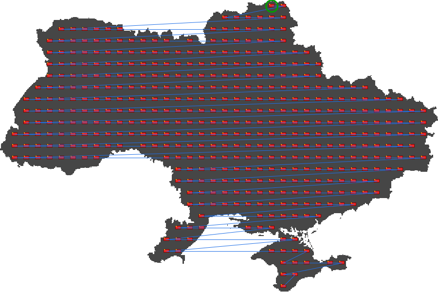
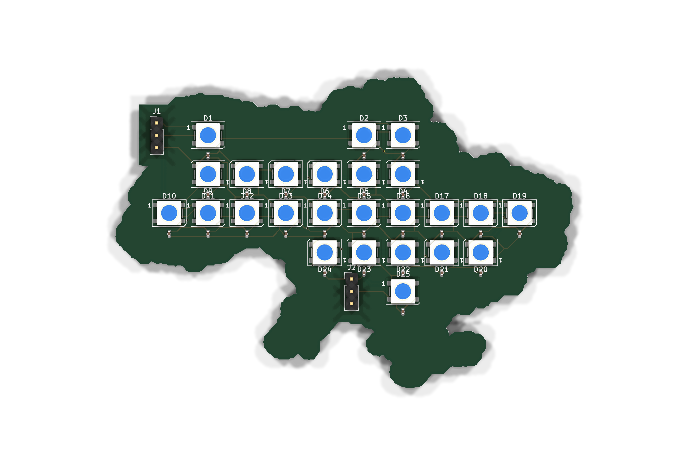
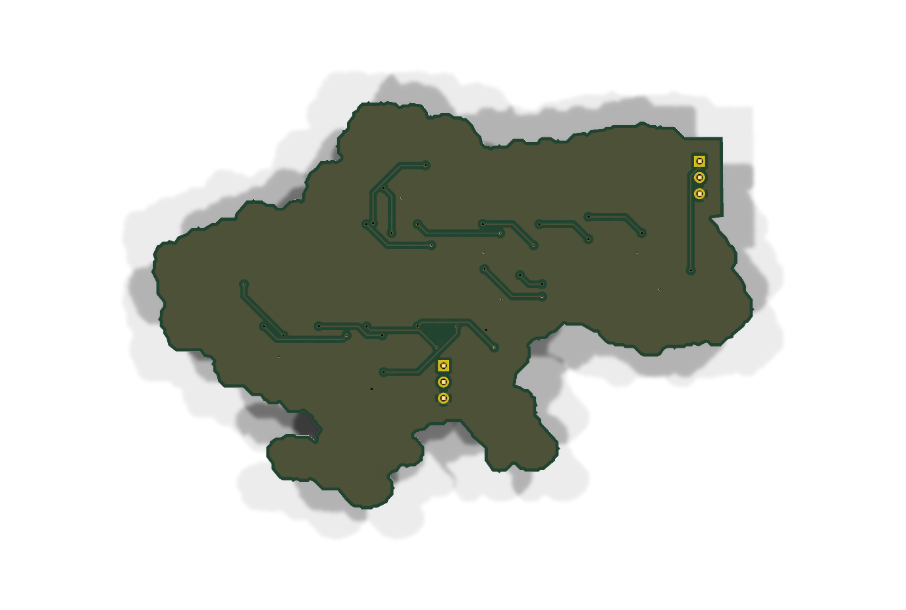
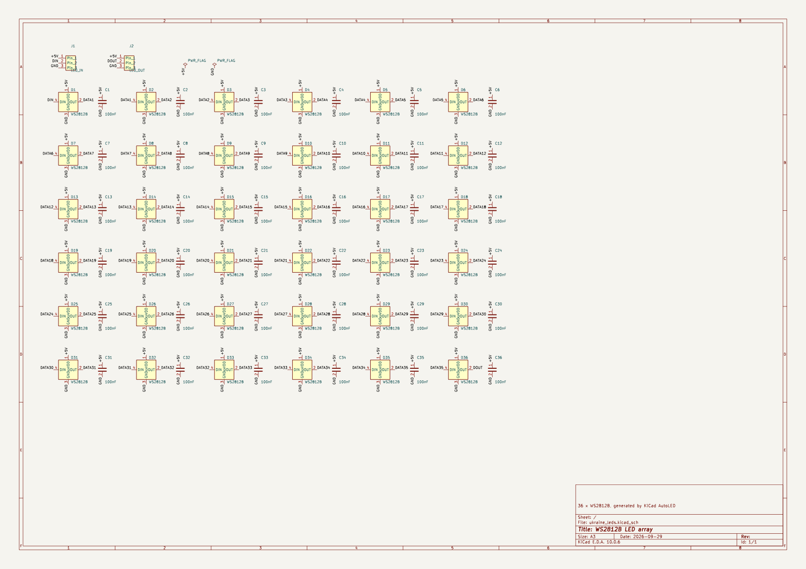
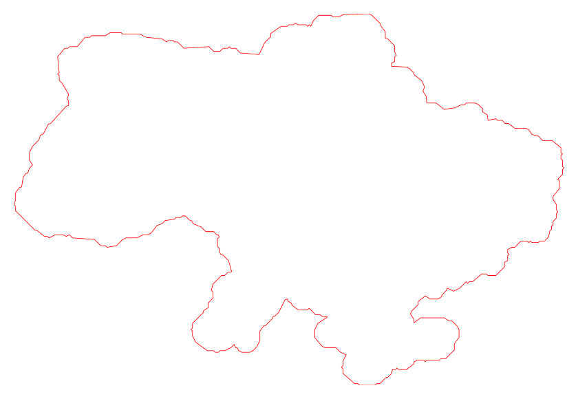

# KiCad AutoLED

A KiCad PCB Editor action plugin that fills a shape from an **SVG, PNG, BMP or JPG** image with a
2D grid of LEDs (WS2812B, SK6812MINI, 0805/0603/1206 …). It can then:

- export the LED map as **JSON**, **TXT** and a **C/C++ header**
- generate a **schematic** (`.kicad_sch`) with matching symbols and nets
- place the footprints on the **PCB** with nets assigned, and optionally draw a board outline that follows the shape
- **autoroute** the board with **Freerouting**, adding a GND plane first

Tested with KiCad 10.0 (SWIG Python API). The generated schematic uses the KiCad 7 file format, so it also opens in KiCad 7, 8 and 9.

## Examples

All images are generated from [tests/ukraine.svg](tests/ukraine.svg).

**Preview in the dialog.** WS2812B at 7 mm pitch, 150 mm wide, 1 mm border offset, zigzag with
180° rotation on backward lines. Red = LED body, yellow dot = pin 1, blue = data chain,
green circle = LED 1.



**Same shape, 0805 LEDs** at 4 mm pitch in *cell coverage ≥ 60 %* mode, rows without zigzag:



**Generated PCB** (KiCad 3D render). 90 mm wide, 8 mm pitch, outline *Image shape + parts*,
routed by Freerouting. Top: LEDs, caps and J1/J2. Bottom: GND plane.

| Top | Bottom |
|---|---|
|  |  |

**Generated schematic.** J1 → D1 → … → D36 → J2 daisy chain with a 100 nF cap per LED; ERC passes with 0 violations:



**Cut line** (*Image shape only*, exported as SVG + DXF):



**Exported map** (`leds.txt`, excerpt):

```text
# grid: 6 rows x 10 cols, 36 LEDs, pitch 8.000 x 8.000 mm
# order: rows, zigzag from top-left

[mask]  # = LED, . = empty
......#...
.######...
#########.
##########
....######
....####..
```

**C header** (`leds.h`, excerpt):

```c
#define LED_ROWS  6
#define LED_COLS  10
#define LED_COUNT 36
#define LED_ZIGZAG 1

static const int8_t led_index[LED_ROWS][LED_COLS] = {
    { -1,  -1,  -1,  -1,  -1,  -1,   0,  -1,  -1,  -1},
    { -1,   6,   5,   4,   3,   2,   1,  -1,  -1,  -1},
    {  7,   8,   9,  10,  11,  12,  13,  14,  15,  -1},
    { 25,  24,  23,  22,  21,  20,  19,  18,  17,  16},
    ...
```

## Install

**Plugin and Content Manager (recommended):**

```sh
python3 tools/build_pcm.py      # -> dist/AutoLED-1.0.0.zip
```

In KiCad, open **Plugin and Content Manager → Install from File…** and pick `dist/AutoLED-1.0.0.zip`.
Don't zip the `auto_led` folder yourself: the Plugin and Content Manager needs the
`metadata.json` / `plugins/` / `resources/` layout that the script builds.

**Development (symlink, edits take effect after Refresh Plugins):**

```sh
./install.sh            # symlinks auto_led/ into ~/Documents/KiCad/<newest>/scripting/plugins
./install.sh 9.0        # or name the KiCad version folder explicitly
```

On Windows, copy the `auto_led` folder to `%USERPROFILE%\Documents\KiCad\<version>\scripting\plugins\`.
Then in the PCB Editor, choose **Tools → External Plugins → Refresh Plugins**. A toolbar button (a red LED grid) appears.

## How it works

1. **Image → black & white.** The image is rendered at *Processing resolution* (SVG via wx.svg).
   Transparent pixels count as white. Pixels darker than the *threshold* become the LED area.
   *Invert* swaps black and white, and *Use alpha channel* uses opacity as the mask instead.
2. **Grid fitting** (*Placement mode*):
   - **Image scale by** sets the physical size of the image: *Width in mm*, *Height in mm*,
     *Percent of native size* (SVG units / image pixels at 96 per inch), or *Image DPI*.
     The status line shows the resulting size in mm.
   - **LED centre inside shape**: a grid with pitch X/Y is centred on the shape. With *Keep whole
     LED body inside* (the default), an LED is placed only where its whole body (rotated) fits in
     the shape, at least *Border offset* mm from the edge. With that option off, only the LED
     **centre** must be *Border offset* mm inside, so the bodies can overhang the edge. A negative
     offset lets LEDs reach that far past the edge.
   - **Cell coverage %**: an LED is placed when at least that fraction of its grid cell is inside the shape.
   - **Pixel**: each black image pixel becomes one LED (useful for pixel art or BMP). The image scale is ignored.
   - *Grid shift X/Y* moves the grid relative to the shape. Empty outer rows and columns are trimmed.
3. **Numbering / chain order.** *Direction* (rows or columns), *Zigzag* (serpentine: every other
   line runs backwards) and *Start corner* set the index of each LED. That index is the order of
   the WS2812 data chain, and the order of the references D1…DN.
   *Rotate LEDs 180° on backward zigzag lines* flips every LED on the lines that run
   backwards, so DIN→DOUT always points along the chain. Decoupling caps stay on the same
   side of every LED, so flipped rows can't collide with the neighbouring row's caps. This gives shorter,
   straighter data traces. The preview shows each LED's orientation with a yellow pin-1 dot,
   and JSON/TXT include `rot_deg` for each LED.

The preview shows the B/W mask, the LED bodies (red), the chain (blue) and LED 1 (green circle).
Settings are saved next to the board as `<board>.autoled.json`.

## Outputs (in *Output folder*, named `<base>.*`)

| File | Content |
|---|---|
| `leds.json` | `rows`, `cols`, `count`, `mask[r][c]` (0/1), `index[r][c]` (-1 = empty), and per LED: `index,row,col,x_mm,y_mm,ref` |
| `leds.txt` | ASCII mask (`#`/`.`), index matrix, LED list |
| `leds.h` | `LED_ROWS/COLS/COUNT/ZIGZAG`, `led_mask[][]`, `led_index[][]`, `led_row[]`, `led_col[]`, `led_at(row,col)` |
| `leds_cut.svg`, `leds_cut.dxf` | Cut line in mm, for laser or CNC cutting (with *Export cut line*). Uses the chosen outline, or the image shape if *Outline* is None |
| `leds.kicad_sch` | Schematic, plus `AutoLED.kicad_sym` (the symbol library, also registered in the project's `sym-lib-table`) |

Example of using the header with FastLED:

```c
#include "leds.h"
CRGB leds[LED_COUNT];
int i = led_at(row, col);          // LED_NONE (-1) if there is no LED there
if (i != LED_NONE) leds[i] = CRGB::Red;
```

## Circuits

- **Addressable** (WS2812B, WS2812B-2020, SK6812MINI): `J1 (+5V, DIN, GND) → D1 → D2 → … → DN → J2 (+5V, DOUT, GND)`.
  J2 lets you chain boards. Optionally each LED gets a 100 nF decoupling cap. Pin numbers match
  KiCad's standard footprints for each part.
- **Simple LEDs** (0805/0603/1206): a row/column matrix. The anode goes to `ROW<r>` and the cathode
  to `COL<c>`, with pin-header connectors for rows and columns (40 pins per header at most).
  Current-limiting resistors and drivers are not generated.

Nets use the names eeschema gives root-sheet labels (`/DIN`, `/DATA3`, `/ROW2`…). Every footprint
is linked to its symbol UUID, so a later **Update PCB from Schematic** keeps everything connected.
To use the generated schematic as the project's main schematic, set *File base name* to the board
name; the old file is kept as `.bak`. When it is added as a sub-sheet instead, choose
"re-link footprints by reference" in the Update PCB from Schematic dialog.

## PCB

- Footprints go at *Origin X/Y*, which is the position of row 0 / column 0. They are placed on the
  chosen side with the chosen rotation, inside a group named `AutoLED`. *Remove previous AutoLED
  group* deletes the earlier run before placing again.
- **Outline / cut line**: one of
  - *Rectangle around parts*
  - *Image shape + parts*: the traced shape, plus every footprint, grown by *Cut line margin*
  - *Image shape only*: the exact image contour grown by the margin

  *Cut line layer* selects Edge.Cuts (the board outline) or a User/Dwgs layer, for example for an
  enclosure or diffuser cut. The GND plane is added only when the cut line is on Edge.Cuts.
- Footprints are looked up via the global and project `fp-lib-table` files, `KICADn_FOOTPRINT_DIR`,
  and the standard install paths. For a custom library, set *Extra footprint folder* or
  *Footprint override* (`Lib:Name`).

## Autorouting (Freerouting)

With *Autoroute with Freerouting* on, the plugin exports a Specctra DSN, runs
`java -jar freerouting.jar -de … -do … -mp <passes>` headless, and imports the `.ses` result.

- The jar is found automatically in the Freerouting KiCad plugin (PCM) folder or `~/Downloads`,
  or you can set it explicitly. Freerouting 2.x needs **Java 21+**. Java is looked up in `JAVA_HOME`,
  `PATH`, Homebrew and the JRE downloaded by the Freerouting plugin.
- A board outline is required. If *Board outline* is None, a rectangle is added automatically.
- *GND plane on opposite side* adds a GND copper zone before routing. This makes routing the
  power nets much easier.
- Routing runs with a cancel-able progress window. The logs and files are kept in the output folder
  as `autoled_route.{dsn,ses,log}`.
- Freerouting sometimes necks tracks down below the netclass width near small pads, which shows up
  as `track_width` DRC errors. Either widen those tracks or lower the minimum track width in Board Setup.

## Command line

The command line runs the same pipeline without the GUI. Use KiCad's Python for SVG rendering and
board editing. The system Python with Pillow works for PNG/BMP exports and schematics.

```sh
KPY=/Applications/KiCad/KiCad.app/Contents/Frameworks/Python.framework/Versions/Current/bin/python3
$KPY -m auto_led.cli tests/ukraine.svg --out-dir out --set width_mm=150 --set pitch_x=7 --set pitch_y=7 \
     --set zigzag=true --board my.kicad_pcb --set outline='"shape"' --set route=true
python3 -m auto_led.cli --list      # all settings and presets
```

## Tests

```sh
python3 -m unittest discover tests
```

## CI / releases

GitHub Actions ([.github/workflows/ci.yml](.github/workflows/ci.yml)):

- **Every push and PR:** compile check and unit tests on Python 3.9 (KiCad's bundled
  version) and 3.12. Then it builds the package, validates `metadata.json` against KiCad's PCM
  schema, and uploads `AutoLED-<version>.zip` plus a `.sha256` file as a workflow artifact.
- **Tag `v*`** (for example `git tag v1.1.0 && git push origin v1.1.0`): builds the package with the
  version taken from the tag and publishes it as a GitHub Release with auto-generated notes.

Locally:

```sh
python3 tools/build_pcm.py --version 1.1.0       # dist/AutoLED-1.1.0.zip + .sha256
pip install jsonschema && python3 tools/validate_pcm.py dist/AutoLED-1.1.0.zip
```
